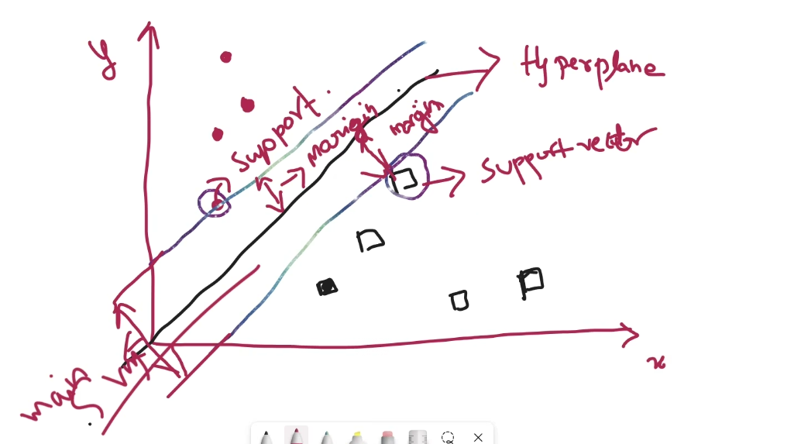

# Contents
- Support Vector Machine
- Random Forest

## Support Vector Machine (SVM)

- Hyperplane
  - The decision boundary that separates the two boundariess
- Support Vectors
  - The data points closest to the hyperplane from each class
- Margin
  - The distance between hyperplane and nearest support vector on each side.
  - Goal - Maximize this margin for better generalisation
***
- Linear model (or Linear SVM) - **2D**
  - We can easily separate from the hyperplane
- Non Linear model (or Non Linear SVM) - **3D**
  - We can't easily separate from the hyperplace
  - 3D space with kernel trick to convert a linear machine into a non-linear machine
  - Types:
    - rbf -> curved boundary
    - poly -> polynomial curve
    - sigmoid -> nueral network

## Random Forest
- Ensemble Learning
- Bootstrap Sampling (Bagging)
- Majority Vote (Prediction)
